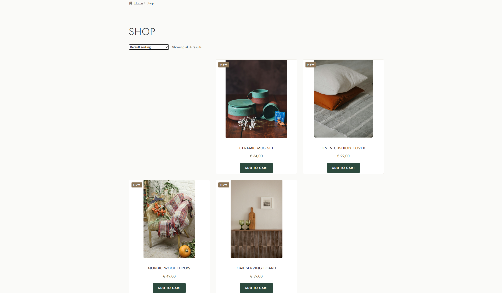
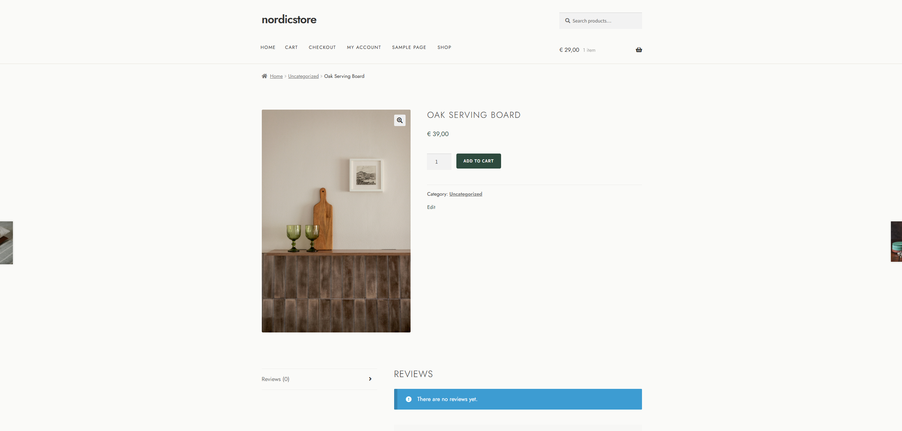
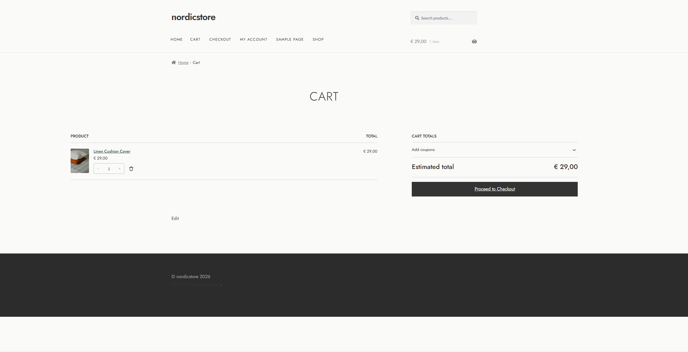

# Nordic & Co - WooCommerce Custom Theme

Custom WordPress child theme and plugin built for a Scandinavian home goods brand.
The client needed a cleaner, more premium look than the off-the-shelf Storefront theme provided.

## Screenshots







## What's included

### Child theme (`nordic-child`)
- Custom colour palette matching the brand identity (muted sand, pine, bark tones)
- CSS Grid product layout (replaces the float-based default)
- Jost typeface — lighter and more on-brand than system sans-serif
- Custom sale badge showing percentage discount instead of "Sale!"
- Category hero banner with image support
- WooCommerce buttons, tables, and checkout restyled

### Plugin (`nordic-customizer`)
- `[nordic_featured]` shortcode — renders a grid of featured products on any page
- "New Arrival" badge for products added within the last 30 days
- Inline badge CSS (no extra stylesheet request)

## Tech

- WordPress 6.5
- WooCommerce 8.9
- PHP 8.1
- MySQL 8.0
- Parent theme: Storefront (free, by WooCommerce)

## Run locally

See [docs/SETUP.md](docs/SETUP.md) for full XAMPP setup instructions.

## Customizations explained

See [docs/FEATURES.md](docs/FEATURES.md) for the reasoning behind each decision.

## Structure

```
nordic-store-wp/
├── theme/
│   └── nordic-child/
│       ├── style.css              ← theme header + all CSS overrides
│       ├── functions.php          ← enqueue styles, sale badge, custom image size
│       └── woocommerce/
│           └── archive-product.php ← custom category page template
├── plugins/
│   └── nordic-customizer/
│       └── nordic-customizer.php  ← shortcode + new-arrival badge
├── docs/
│   ├── SETUP.md
│   └── FEATURES.md
└── screenshots/
    └── (add screenshots here)
```

## Contact

Built by Wait2result · [Upwork profile](https://www.upwork.com/freelancers/~011585f72da72aee46)
